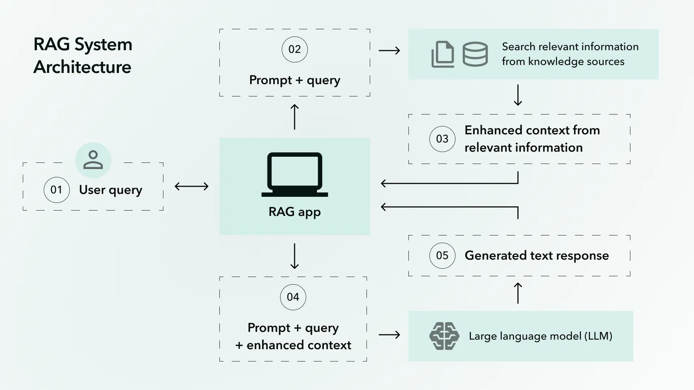
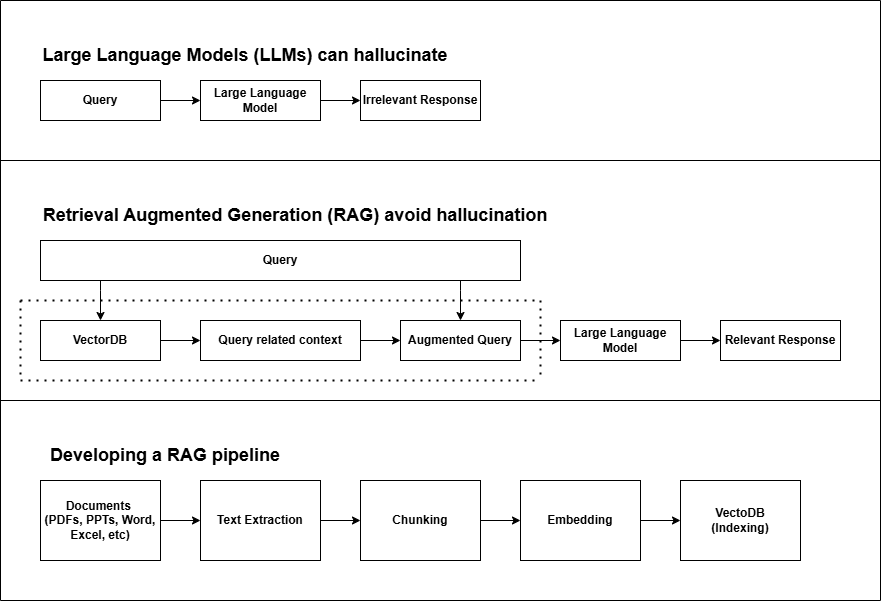

# RAG System from Scratch

This repository contains a Retrieval-Augmented Generation (RAG) system built from scratch. RAG is a technique that enhances Large Language Models (LLMs) by retrieving relevant external knowledge before generating responses, reducing hallucinations and improving accuracy.

## Project Structure

```
RAG-Project/
│-- rag_from_scratch.py        # Main script implementing RAG
│-- data/
│   ├── production-information.pdf  # Additional reference data
│   ├── how-to-guides.pdf          # Guides for the system
│   ├── FAQs.pdf                   # Frequently asked questions
│-- images/
│   ├── RAG.jpeg                   # RAG system architecture image
│   ├── RAG_vs_LLM.png              # Comparison of LLM vs RAG
│-- README.md                       # Project documentation
```

## What is Retrieval-Augmented Generation (RAG)?

Traditional LLMs generate responses based purely on their pre-trained knowledge. However, they suffer from **hallucination**, meaning they might provide incorrect or outdated information confidently.

**RAG** enhances LLMs by incorporating an external retrieval mechanism. The process is as follows:

1. A **user query** is received.
2. Relevant context is retrieved from a **Vector Database (VectorDB)**.
3. The query is augmented with retrieved information.
4. The enhanced query is passed to the LLM.
5. The LLM generates a **relevant and fact-based response**.

### Difference Between LLM and RAG

| Feature | Large Language Model (LLM) | Retrieval-Augmented Generation (RAG) |
|---------|----------------------------|--------------------------------------|
| Knowledge Source | Pre-trained data only | External knowledge retrieval + Pre-trained data |
| Hallucination Risk | High | Low (fact-based responses) |
| Real-time Updates | Not possible | Can retrieve up-to-date info |
| Use Cases | General text generation | Fact-based Q&A, document search, enterprise AI |

## Architecture
The architecture of the RAG system is illustrated below:



A comparison of **LLM vs. RAG** is illustrated below:



## Running the Project

### Prerequisites
- Python 3.8+
- `pip install -r requirements.txt` (if dependencies are needed)

### Running the Script
```bash
python rag_from_scratch.py
```
This will execute the RAG pipeline, retrieving relevant information before generating responses.

## Additional Resources
- The `data/` folder contains supporting documents that can be indexed for retrieval.
- The `images/` folder has visual explanations of the RAG process.

## Contributing
Feel free to fork this repository, submit pull requests, or report issues to enhance the project.
